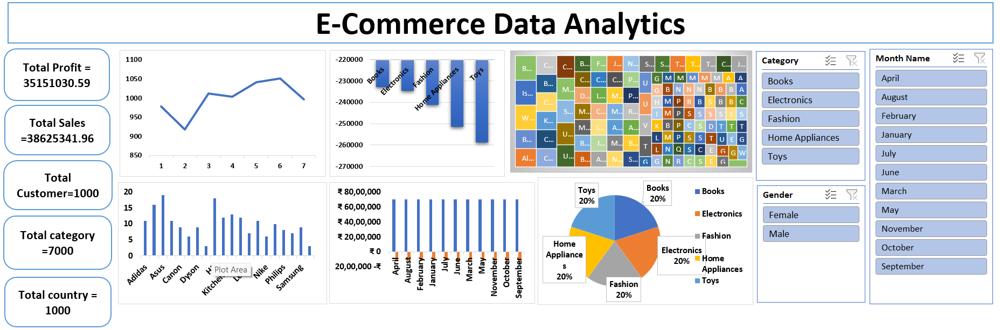

# E-Commerce-Data-Analytics-Dashboard

## Dashboard Preview

---

## Project Overview

This project presents an E-Commerce Data Analytics Dashboard created to analyze sales, profit, customers, categories, countries, products, and monthly performance.

The dashboard helps understand business performance, product demand, customer distribution, and category-wise sales insights.

---

## Key KPIs

| KPI | Value |
|---|---:|
| Total Profit | 35,151,030.59 |
| Total Sales | 38,625,341.96 |
| Total Customers | 1,000 |
| Total Categories | 7,000 |
| Total Countries | 1,000 |

---

## Dashboard Insights

- Analyzed total sales and profit performance.
- Tracked product/category performance across Books, Electronics, Fashion, Home Appliances, and Toys.
- Compared monthly performance using interactive filters.
- Used gender filter to analyze customer-level patterns.
- Visualized category distribution using pie chart and treemap.
- Identified product and brand-wise performance trends.

---

## Tools Used

- Microsoft Excel
- Pivot Tables
- Pivot Charts
- Slicers
- Dashboard Design
- Data Cleaning

---

## Skills Demonstrated

- Data Cleaning
- Data Analysis
- KPI Reporting
- Dashboard Development
- Data Visualization
- Business Intelligence

---

## Business Impact

This dashboard helps business stakeholders monitor sales, profit, customer behavior, and category performance in one place. It supports better decisions related to product planning, marketing strategy, and sales performance tracking.

---

## Project Files

- Excel Dashboard: `E Commerce Data.xlsx`
- PDF Report: `E-COMMERCE.pdf`
- Dashboard Screenshot: `E-COMMERCE.png`
- Dataset: `E commerce Data.xlsx`

---

## Author

**Rohit Prajapati**

LinkedIn: https://www.linkedin.com/in/rohit-prajapati148/
